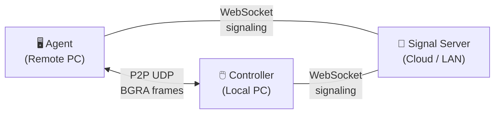

# CppDesk — Remote Desktop for Windows

[](https://en.cppreference.com/w/cpp/20)
[](https://www.microsoft.com/windows)
[](LICENSE)

A high-performance remote desktop tool for Windows, built from scratch in C++20. Streams a remote screen to a local viewer over **P2P UDP** with DXGI desktop duplication, Direct2D rendering, and ECDH-encrypted transport.

## Architecture



| Component | Role | Type |
|-----------|------|------|
| **agent.exe** | Runs on the controlled PC — captures screen via DXGI, sends raw frames, receives & injects input events | Console |
| **controller.exe** | Runs on the viewing PC — receives frames, renders via Direct2D, captures & sends mouse/keyboard input | GUI (Win32) |
| **signal-server.exe** | Lightweight WebSocket relay for SDP exchange & NAT traversal coordination | Console |

## Features

- **Native Resolution** — streams at the remote monitor's full resolution (tested at 2560×1440)
- **Raw BGRA Transport** — uncompressed pixel data over UDP for zero-latency, lossless quality
- **P2P UDP** — direct peer-to-peer connection after signaling, no relay bottleneck
- **ECDH Key Exchange** — libsodium-powered encryption handshake
- **DXGI Desktop Duplication** — hardware-accelerated screen capture via D3D11
- **Direct2D Rendering** — GPU-accelerated frame display on the controller side
- **Input Injection** — keyboard & mouse events forwarded via `SendInput`
- **Clipboard Sync** — bidirectional text clipboard monitoring
- **File Transfer** — chunked file transfer with sliding-window protocol (framework ready)

## Quick Start

### Prerequisites

- **Windows 10/11** with MSVC 2022
- **CMake** ≥ 3.20
- **vcpkg** (set `VCPKG_ROOT` environment variable)

### 1. Install Dependencies

```powershell
vcpkg install ffmpeg libsodium nlohmann-json --triplet x64-windows
```

### 2. Build

```powershell
git clone https://github.com/TiAmo-one/CppDesk.git
cd CppDesk
cmake -B build -S . -DCMAKE_TOOLCHAIN_FILE="$env:VCPKG_ROOT/scripts/buildsystems/vcpkg.cmake"
cmake --build build --config Release
```

Binaries are output to:
- `build/apps/agent/Release/agent.exe`
- `build/apps/controller/Release/controller.exe`
- `build/apps/signal-server/Release/signal-server.exe`

### 3. Run

**Step 1** — Start the signal server (any machine reachable by both peers):

```powershell
.\build\apps\signal-server\Release\signal-server.exe 18443
```

**Step 2** — On the remote PC (the one to be controlled):

```powershell
.\build\apps\agent\Release\agent.exe <server_ip> 18443 my-room mypassword
```

**Step 3** — On the local PC (the viewer):

```powershell
.\build\apps\controller\Release\controller.exe <server_ip> 18443 my-room mypassword
```

> **Note:** For local testing, use `127.0.0.1` as the server IP for all three processes.

## Project Structure

```
CppDesk/
├── apps/
│   ├── agent/              # Remote PC agent (screen capture + input injection)
│   ├── controller/         # Local PC viewer (frame rendering + input capture)
│   └── signal-server/      # WebSocket signaling relay (SDP exchange)
├── libs/
│   ├── libcapture/         # DXGI desktop duplication (D3D11)
│   ├── libclipboard/       # Clipboard monitor & sync
│   ├── libencode/          # x264 encoder (optional, currently disabled)
│   ├── libfiletransfer/    # Chunked file transfer with sliding window
│   ├── libinput/           # SendInput keyboard/mouse injection
│   ├── libnetwork/         # UDP socket, STUN, WebSocket client, hole punch, ECDH
│   ├── libproto/           # Binary frame protocol (wire format)
│   └── libui/              # Direct2D render window
├── build/                  # Build output (gitignored)
├── CMakeLists.txt          # Root CMake configuration
└── .gitignore
```

## Wire Protocol

Each frame is wrapped in a compact binary header and sent as a UDP datagram:

```
┌──────────┬──────┬────────┬──────────┬─────────────────────┐
│  magic   │ type │ length │ sequence │      payload        │
│  4 bytes │ 1 B  │ 2 B    │  8 B     │  up to 65480 bytes  │
└──────────┴──────┴────────┴──────────┴─────────────────────┘
```

Video frames are split into chunks of ≤ 65480 bytes (fits UDP 65507-byte payload limit). Each chunk carries a fragment index, width, and height for reliable reassembly.

**Message types:**

| Type | Value | Description |
|------|-------|-------------|
| `Video` | 0x01 | BGRA frame fragment |
| `MouseMove` | 0x02 | Normalized cursor position |
| `MouseBtn` | 0x03 | Button press/release |
| `KeyEvent` | 0x04 | Keyboard scan code |
| `ClipboardText` | 0x05 | Text clipboard sync |
| `ClipboardFile` | 0x06 | File clipboard sync |
| `FileBlock` | 0x07 | File transfer chunk |
| `Heartbeat` | 0x08 | Keep-alive ping |
| `Resolution` | 0x09 | Display resolution change |

## Dependencies

| Library | Purpose |
|---------|---------|
| **FFmpeg** (libavcodec, libswscale) | Controller-side frame decoding (reserved for H.264) |
| **libsodium** | ECDH key exchange (`crypto_box`) |
| **nlohmann/json** | JSON parsing for WebSocket signaling |
| **DirectX 11 / DXGI 1.2** | Screen capture & GPU rendering |
| **WinSock2** | UDP/TCP networking |

## Troubleshooting

### Controller shows a blank window

1. Ensure the signal server is running and reachable from both peers.
2. Check that room ID and password match on agent and controller.
3. Verify the agent captures successfully — look for `Capture: WxH` in agent output.
4. If using firewall software, allow UDP traffic on ephemeral ports.

### Build fails with missing vcpkg packages

```powershell
vcpkg list                          # verify installed packages
vcpkg integrate install             # ensure MSBuild integration
echo $env:VCPKG_ROOT               # must point to vcpkg root
```

### Poor frame rate / stuttering

The current implementation sends **raw BGRA** frames (~14.7 MB/frame at 2560×1440). For production use over real networks, enable the x264 encoder in `libs/libencode/` and uncomment the relevant CMake lines. Raw mode is designed for LAN and localhost testing.

## Roadmap

- [ ] H.264/H.265 hardware encoding via NVENC/AMF
- [ ] Multi-monitor support
- [ ] Audio streaming & microphone forwarding
- [ ] UAC/secure desktop handling (run as Windows service)
- [ ] Adaptive bitrate & dynamic quality
- [ ] Mobile controller client (iOS/Android)

## License

MIT — see [LICENSE](LICENSE) for details.
